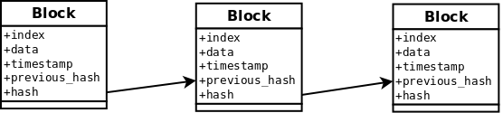

# Blockathon 

## Omschrijving
Dit project is een basis implementatie van een blockchain oplossing. 

## Werking
Het basis principe van de blockchain is dat een volgend bericht een onderdeel van het laatst opgenomen bericht op zich neemt. Hierdoor kan je, door het volgen van deze onderdelen in een bericht de hele chain teruglopen tot het originele bericht. Dit originele bericht het ook wel het genesis bericht. Op het moment is er veel te doen om blockchains, vanwege het gebruik van blockchain in cryptocurrencies. 

In dit project tracht Montelbaan een blockchain implementatie te doen. De blockchain is slechts een onderdeel van cryptocurrencies maar sommige technieken nemen we over.

### Block structuur
Een bericht kan vertaald worden naar een 'block' met gegevens. Deze implementatie gebruikt voor de block met gegevens een index, timestamp, data, hash en previous hash.



```python
class Block:
    def __init__(self, index, data, previous_hash):
        self.index = index
        self.data = data
        self.timestamp = date.datetime.now()
        self.previous_hash = previous_hash
        self.hash = self.hash_block()
```

### Block hashing
Ieder block dient gehashed te worden, waardoor de block vast ligt in een hash die als input dient voor het volgende block.

```python
    def hash_block(self):
        sha = hasher.sha256()
        sha.update(str(self.index) + str(self.timestamp) + str(self.data) + str(self.previous_hash))
        return sha.hexdigest()
```

### Opslag blocks
Het systeem slaat de blocks op d.m.v. serialization van objecten naar file's. De centrale opslag bevind zich in /usr/local/blockathon map. Elk block krijgt als benaming van zijn eigen block zijn eigen hashwaarde mee. 

```python
def writer(Block):
    block_hash = Block.hash_block()

    print 'Writing block...%s' % (block_hash)
    pickle.dump(Block, open("/usr/local/blockathon/%s" % (block_hash), "wb"))
```

### Duplicatie problemen
Het systeem werkt soms zo snel achter (lees:door elkaar) dat er 2 blocks met dezelfde previous hash wordt aangemaakt. Hierdoor krijgt je een splitsing van de blockchain. Dit is niet wenselijk daarom doen we een validatie op de langste chain en kiezen we die als de main chain. De kleinere takken van deze chainn worden automatisch verwijderd.

```python
    while (previous_hash != '0'):
        block = read_chain.single_block(previous_hash)
        hash_list.append(block.get_hash())
        previous_hash = block.get_previous_hash()

    if hash in hash_list:
        return True
    else:
        return False
```
